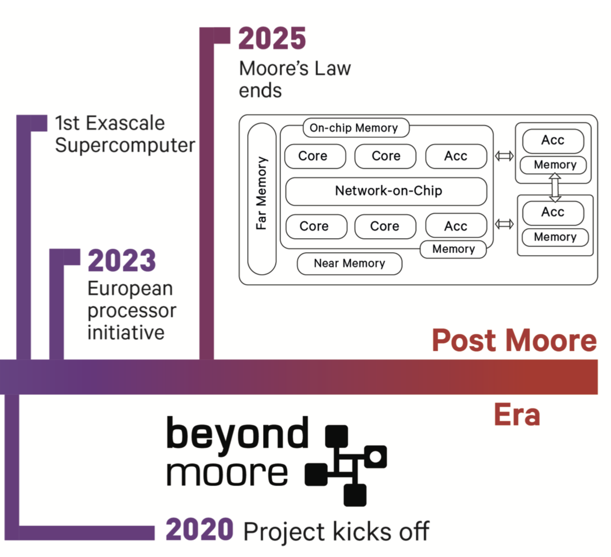

# Abstract

  

**BeyondMoore** addresses the timely research challenge of solving the software side of the Post Moore crisis. The techno-economical model in computing, known as the Moore’s Law, has led to an exceptionally productive era for humanity and numerous scientific discoveries over the past 50+ years. However, due to the fundamental limits in chip manufacturing we are about to mark the end of Moore’s Law and enter a new era of computing where continued performance improvement will likely emerge from extreme heterogeneity. The new systems are expected to bring a diverse set of hardware accelerators and memory technologies.

**BeyondMoore** has an ambitious goal to develop a software framework that performs static and dynamic optimizations, issues accelerator-initiated data transfers, and reasons about parallel execution strategies that exploit both processor and memory heterogeneity.

**Budget**: 1.5 Million Euros

  

  

