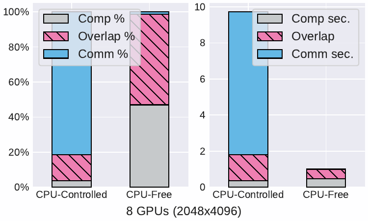
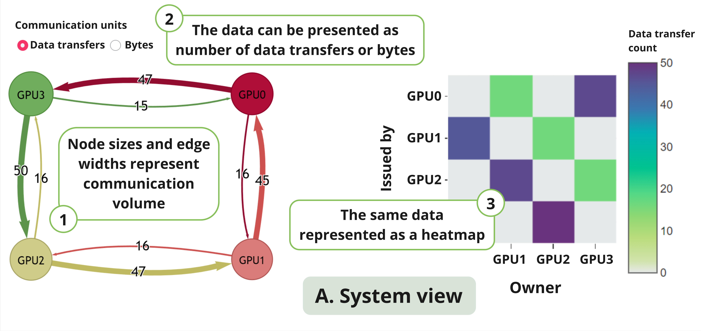
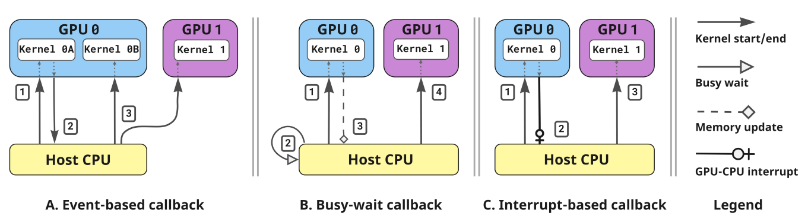
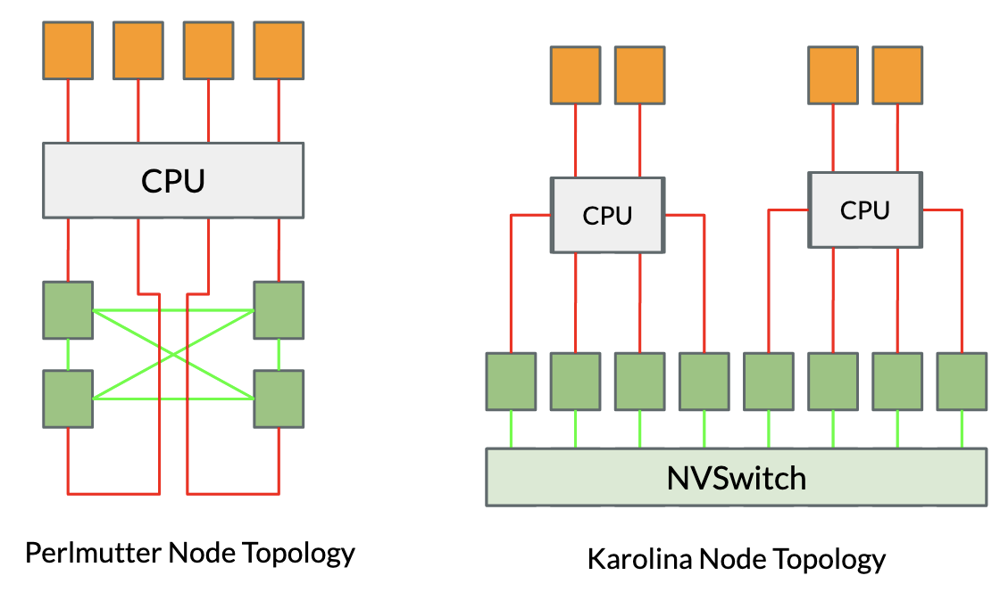
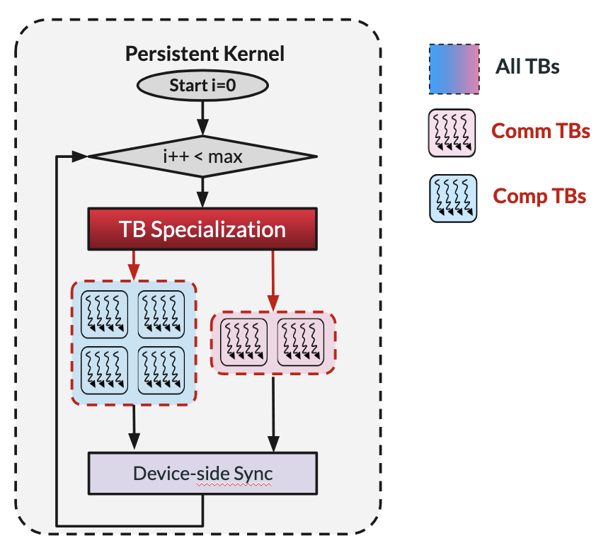
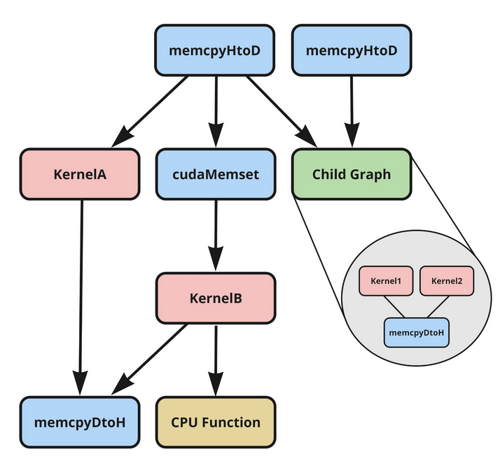
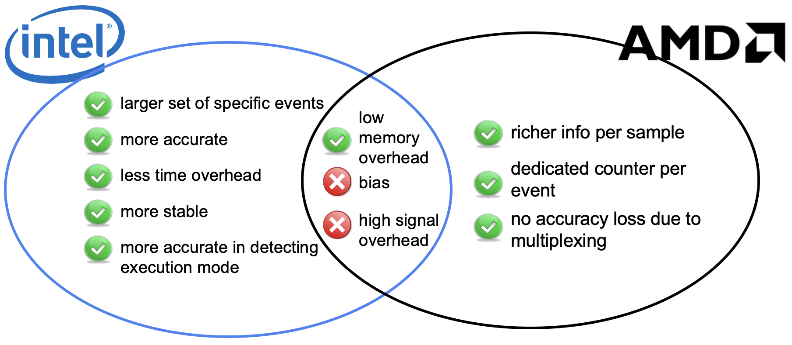

  

    <svg version="1.1" id="svg1" width="20%" height="20%" viewBox="0 0 731 727" sodipodi:docname="beyondmoore-logo.svg"
      inkscape:version="1.3.2 (091e20ef0f, 2023-11-25)" xmlns:inkscape="http://www.inkscape.org/namespaces/inkscape"
      xmlns:sodipodi="http://sodipodi.sourceforge.net/DTD/sodipodi-0.dtd" xmlns="http://www.w3.org/2000/svg"
      xmlns:svg="http://www.w3.org/2000/svg"> <defs id="defs1" /> <sodipodi:namedview id="namedview1" pagecolor="#ffffff"
      bordercolor="#000000" borderopacity="0.25" inkscape:showpageshadow="2" inkscape:pageopacity="0.0"
      inkscape:pagecheckerboard="0" inkscape:deskcolor="#d1d1d1" showgrid="false" inkscape:zoom="0.90938245"
      inkscape:cx="548.1742" inkscape:cy="409.61864" inkscape:window-width="1920" inkscape:window-height="1011"
      inkscape:window-x="0" inkscape:window-y="0" inkscape:window-maximized="1" inkscape:current-layer="g1" /> <g
      inkscape:groupmode="layer" inkscape:label="Image" id="g1"> <g id="g82" style="fill:#c10b25;fill-opacity:1"> <g
      id="rect1" style="fill:#c10b25;fill-opacity:1"> <path
      style="color:#000000;fill:#c10b25;stroke-linecap:round;stroke-linejoin:round;-inkscape-stroke:none;fill-opacity:1" d="M
      212.18864,30.882252 H 355.88762 V 174.58123 H 212.18864 Z" id="path15" /> <path
      style="color:#000000;fill:#c10b25;stroke-linecap:round;stroke-linejoin:round;-inkscape-stroke:none;fill-opacity:1" d="M
      212.18945,2.1113281 A 28.774527,28.774527 0 0 0 183.41797,30.882812 V 174.58203 a 28.774527,28.774527 0 0 0
      28.77148,28.77149 h 143.69727 a 28.774527,28.774527 0 0 0 28.77344,-28.77149 V 30.882812 A 28.774527,28.774527 0 0 0
      355.88672,2.1113281 Z m 28.77149,57.5429689 h 86.15429 v 86.156253 h -86.15429 z" id="path16" /> </g> <g id="rect2"
      style="fill:#c10b25;fill-opacity:1"> <path
      style="color:#000000;fill:#c10b25;stroke-linecap:round;stroke-linejoin:round;-inkscape-stroke:none;fill-opacity:1" d="M
      30.674997,371.48712 H 174.37397 V 515.1861 H 30.674997 Z" id="path13" /> <path
      style="color:#000000;fill:#c10b25;stroke-linecap:round;stroke-linejoin:round;-inkscape-stroke:none;fill-opacity:1" d="M
      30.675781,342.71484 A 28.774527,28.774527 0 0 0 1.9042969,371.48633 V 515.18555 A 28.774527,28.774527 0 0 0
      30.675781,543.95703 H 174.37305 a 28.774527,28.774527 0 0 0 28.77343,-28.77148 V 371.48633 a 28.774527,28.774527 0 0 0
      -28.77343,-28.77149 z m 28.771485,57.54297 h 86.154294 v 86.15625 H 59.447266 Z" id="path14" /> </g> <g id="rect3"
      style="fill:#c10b25;fill-opacity:1"> <path
      style="color:#000000;fill:#c10b25;stroke-linecap:round;stroke-linejoin:round;-inkscape-stroke:none;fill-opacity:1" d="M
      376.87323,554.55786 H 520.5722 V 698.25684 H 376.87323 Z" id="path17" /> <path
      style="color:#000000;fill:#c10b25;stroke-linecap:round;stroke-linejoin:round;-inkscape-stroke:none;fill-opacity:1" d="m
      376.87305,525.78711 a 28.774527,28.774527 0 0 0 -28.77149,28.77148 v 143.69922 a 28.774527,28.774527 0 0 0
      28.77149,28.77149 h 143.69922 a 28.774527,28.774527 0 0 0 28.77148,-28.77149 V 554.55859 a 28.774527,28.774527 0 0 0
      -28.77148,-28.77148 z m 28.77148,57.54297 h 86.15625 v 86.15429 h -86.15625 z" id="path18" /> </g> <path id="path5"
      style="color:#000000;fill:#c10b25;fill-opacity:1;stroke:none;stroke-linecap:round;stroke-linejoin:round;-inkscape-stroke:none"
      d="M 558.51618,183.65732 A 28.774527,28.774527 0 0 0 529.7447,212.4288 v 143.69922 a 28.774527,28.774527 0 0 0
      28.77148,28.77149 H 702.2154 a 28.774527,28.774527 0 0 0 28.77149,-28.77149 V 212.4288 A 28.774527,28.774527 0 0 0
      702.2154,183.65732 Z m 71.84961,49.32617 a 51.295004,51.295004 0 0 1 51.29492,51.29492 51.295004,51.295004 0 0 1
      -51.29492,51.29492 51.295004,51.295004 0 0 1 -51.29492,-51.29492 51.295004,51.295004 0 0 1 51.29492,-51.29492 z" />
      <rect
      style="fill:#c10b25;fill-opacity:1;stroke:none;stroke-width:56.5122;stroke-linecap:round;stroke-linejoin:round;stroke-dasharray:none;stroke-opacity:1"
      id="rect9" width="47.264641" height="259.48355" x="-308.53714" y="270.48721" transform="rotate(-90)" /> <rect
      style="fill:#c10b25;fill-opacity:1;stroke:none;stroke-width:56.0422;stroke-linecap:round;stroke-linejoin:round;stroke-dasharray:none;stroke-opacity:1"
      id="rect10" width="47.264641" height="255.1857" x="-466.54218" y="202.76114" transform="rotate(-90)" /> <rect
      style="fill:#c10b25;fill-opacity:1;stroke:none;stroke-width:56.3962;stroke-linecap:round;stroke-linejoin:round;stroke-dasharray:none;stroke-opacity:1"
      id="rect11" width="47.264641" height="258.41992" x="-472.41852" y="-531.03186" transform="scale(-1)" /> <rect
      style="fill:#c10b25;fill-opacity:1;stroke:none;stroke-width:56.5466;stroke-linecap:round;stroke-linejoin:round;stroke-dasharray:none;stroke-opacity:1"
      id="rect12" width="47.264641" height="259.80017" x="-307.37561" y="-456.49554" transform="scale(-1)" /> <g id="g20"
      style="fill:#c10b25;fill-opacity:1"> <path
      style="color:#000000;fill:#c10b25;stroke-linecap:round;stroke-linejoin:round;-inkscape-stroke:none;fill-opacity:1" d="M
      212.18864,30.882252 H 355.88762 V 174.58123 H 212.18864 Z" id="path19" /> <path
      style="color:#000000;fill:#c10b25;stroke-linecap:round;stroke-linejoin:round;-inkscape-stroke:none;fill-opacity:1" d="M
      212.18945,2.1113281 A 28.774527,28.774527 0 0 0 183.41797,30.882812 V 174.58203 a 28.774527,28.774527 0 0 0
      28.77148,28.77149 h 143.69727 a 28.774527,28.774527 0 0 0 28.77344,-28.77149 V 30.882812 A 28.774527,28.774527 0 0 0
      355.88672,2.1113281 Z m 28.77149,57.5429689 h 86.15429 v 86.156253 h -86.15429 z" id="path20" /> </g> <g id="g22"
      style="fill:#c10b25;fill-opacity:1"> <path
      style="color:#000000;fill:#c10b25;stroke-linecap:round;stroke-linejoin:round;-inkscape-stroke:none;fill-opacity:1" d="M
      30.674997,371.48712 H 174.37397 V 515.1861 H 30.674997 Z" id="path21" /> <path
      style="color:#000000;fill:#c10b25;stroke-linecap:round;stroke-linejoin:round;-inkscape-stroke:none;fill-opacity:1" d="M
      30.675781,342.71484 A 28.774527,28.774527 0 0 0 1.9042969,371.48633 V 515.18555 A 28.774527,28.774527 0 0 0
      30.675781,543.95703 H 174.37305 a 28.774527,28.774527 0 0 0 28.77343,-28.77148 V 371.48633 a 28.774527,28.774527 0 0 0
      -28.77343,-28.77149 z m 28.771485,57.54297 h 86.154294 v 86.15625 H 59.447266 Z" id="path22" /> </g> <g id="g24"
      style="fill:#c10b25;fill-opacity:1"> <path
      style="color:#000000;fill:#c10b25;stroke-linecap:round;stroke-linejoin:round;-inkscape-stroke:none;fill-opacity:1" d="M
      376.87323,554.55786 H 520.5722 V 698.25684 H 376.87323 Z" id="path23" /> <path
      style="color:#000000;fill:#c10b25;stroke-linecap:round;stroke-linejoin:round;-inkscape-stroke:none;fill-opacity:1" d="m
      376.87305,525.78711 a 28.774527,28.774527 0 0 0 -28.77149,28.77148 v 143.69922 a 28.774527,28.774527 0 0 0
      28.77149,28.77149 h 143.69922 a 28.774527,28.774527 0 0 0 28.77148,-28.77149 V 554.55859 a 28.774527,28.774527 0 0 0
      -28.77148,-28.77148 z m 28.77148,57.54297 h 86.15625 v 86.15429 h -86.15625 z" id="path24" /> </g> <path id="path25"
      style="color:#000000;fill:#c10b25;fill-opacity:1;stroke:none;stroke-linecap:round;stroke-linejoin:round;-inkscape-stroke:none"
      d="M 558.51618,183.65732 A 28.774527,28.774527 0 0 0 529.7447,212.4288 v 143.69922 a 28.774527,28.774527 0 0 0
      28.77148,28.77149 H 702.2154 a 28.774527,28.774527 0 0 0 28.77149,-28.77149 V 212.4288 A 28.774527,28.774527 0 0 0
      702.2154,183.65732 Z m 71.84961,49.32617 a 51.295004,51.295004 0 0 1 51.29492,51.29492 51.295004,51.295004 0 0 1
      -51.29492,51.29492 51.295004,51.295004 0 0 1 -51.29492,-51.29492 51.295004,51.295004 0 0 1 51.29492,-51.29492 z" />
      <rect
      style="fill:#c10b25;fill-opacity:1;stroke:none;stroke-width:56.5122;stroke-linecap:round;stroke-linejoin:round;stroke-dasharray:none;stroke-opacity:1"
      id="rect25" width="47.264641" height="259.48355" x="-308.53714" y="270.48721" transform="rotate(-90)" /> <rect
      style="fill:#c10b25;fill-opacity:1;stroke:none;stroke-width:56.0422;stroke-linecap:round;stroke-linejoin:round;stroke-dasharray:none;stroke-opacity:1"
      id="rect26" width="47.264641" height="255.1857" x="-466.54218" y="202.76114" transform="rotate(-90)" /> <rect
      style="fill:#c10b25;fill-opacity:1;stroke:none;stroke-width:56.3962;stroke-linecap:round;stroke-linejoin:round;stroke-dasharray:none;stroke-opacity:1"
      id="rect27" width="47.264641" height="258.41992" x="-472.41852" y="-531.03186" transform="scale(-1)" /> <rect
      style="fill:#c10b25;fill-opacity:1;stroke:none;stroke-width:56.5466;stroke-linecap:round;stroke-linejoin:round;stroke-dasharray:none;stroke-opacity:1"
      id="rect28" width="47.264641" height="259.80017" x="-307.37561" y="-456.49554" transform="scale(-1)" /> <g id="g29"
      style="fill:#c10b25;fill-opacity:1"> <path
      style="color:#000000;fill:#c10b25;stroke-linecap:round;stroke-linejoin:round;-inkscape-stroke:none;fill-opacity:1" d="M
      212.18864,30.882252 H 355.88762 V 174.58123 H 212.18864 Z" id="path28" /> <path
      style="color:#000000;fill:#c10b25;stroke-linecap:round;stroke-linejoin:round;-inkscape-stroke:none;fill-opacity:1" d="M
      212.18945,2.1113281 A 28.774527,28.774527 0 0 0 183.41797,30.882812 V 174.58203 a 28.774527,28.774527 0 0 0
      28.77148,28.77149 h 143.69727 a 28.774527,28.774527 0 0 0 28.77344,-28.77149 V 30.882812 A 28.774527,28.774527 0 0 0
      355.88672,2.1113281 Z m 28.77149,57.5429689 h 86.15429 v 86.156253 h -86.15429 z" id="path29" /> </g> <g id="g31"
      style="fill:#c10b25;fill-opacity:1"> <path
      style="color:#000000;fill:#c10b25;stroke-linecap:round;stroke-linejoin:round;-inkscape-stroke:none;fill-opacity:1" d="M
      30.674997,371.48712 H 174.37397 V 515.1861 H 30.674997 Z" id="path30" /> <path
      style="color:#000000;fill:#c10b25;stroke-linecap:round;stroke-linejoin:round;-inkscape-stroke:none;fill-opacity:1" d="M
      30.675781,342.71484 A 28.774527,28.774527 0 0 0 1.9042969,371.48633 V 515.18555 A 28.774527,28.774527 0 0 0
      30.675781,543.95703 H 174.37305 a 28.774527,28.774527 0 0 0 28.77343,-28.77148 V 371.48633 a 28.774527,28.774527 0 0 0
      -28.77343,-28.77149 z m 28.771485,57.54297 h 86.154294 v 86.15625 H 59.447266 Z" id="path31" /> </g> <g id="g33"
      style="fill:#c10b25;fill-opacity:1"> <path
      style="color:#000000;fill:#c10b25;stroke-linecap:round;stroke-linejoin:round;-inkscape-stroke:none;fill-opacity:1" d="M
      376.87323,554.55786 H 520.5722 V 698.25684 H 376.87323 Z" id="path32" /> <path
      style="color:#000000;fill:#c10b25;stroke-linecap:round;stroke-linejoin:round;-inkscape-stroke:none;fill-opacity:1" d="m
      376.87305,525.78711 a 28.774527,28.774527 0 0 0 -28.77149,28.77148 v 143.69922 a 28.774527,28.774527 0 0 0
      28.77149,28.77149 h 143.69922 a 28.774527,28.774527 0 0 0 28.77148,-28.77149 V 554.55859 a 28.774527,28.774527 0 0 0
      -28.77148,-28.77148 z m 28.77148,57.54297 h 86.15625 v 86.15429 h -86.15625 z" id="path33" /> </g> <path id="path34"
      style="color:#000000;fill:#c10b25;fill-opacity:1;stroke:none;stroke-linecap:round;stroke-linejoin:round;-inkscape-stroke:none"
      d="M 558.51618,183.65732 A 28.774527,28.774527 0 0 0 529.7447,212.4288 v 143.69922 a 28.774527,28.774527 0 0 0
      28.77148,28.77149 H 702.2154 a 28.774527,28.774527 0 0 0 28.77149,-28.77149 V 212.4288 A 28.774527,28.774527 0 0 0
      702.2154,183.65732 Z m 71.84961,49.32617 a 51.295004,51.295004 0 0 1 51.29492,51.29492 51.295004,51.295004 0 0 1
      -51.29492,51.29492 51.295004,51.295004 0 0 1 -51.29492,-51.29492 51.295004,51.295004 0 0 1 51.29492,-51.29492 z" />
      <rect
      style="fill:#c10b25;fill-opacity:1;stroke:none;stroke-width:56.5122;stroke-linecap:round;stroke-linejoin:round;stroke-dasharray:none;stroke-opacity:1"
      id="rect34" width="47.264641" height="259.48355" x="-308.53714" y="270.48721" transform="rotate(-90)" /> <rect
      style="fill:#c10b25;fill-opacity:1;stroke:none;stroke-width:56.0422;stroke-linecap:round;stroke-linejoin:round;stroke-dasharray:none;stroke-opacity:1"
      id="rect35" width="47.264641" height="255.1857" x="-466.54218" y="202.76114" transform="rotate(-90)" /> <rect
      style="fill:#c10b25;fill-opacity:1;stroke:none;stroke-width:56.3962;stroke-linecap:round;stroke-linejoin:round;stroke-dasharray:none;stroke-opacity:1"
      id="rect36" width="47.264641" height="258.41992" x="-472.41852" y="-531.03186" transform="scale(-1)" /> <rect
      style="fill:#c10b25;fill-opacity:1;stroke:none;stroke-width:56.5466;stroke-linecap:round;stroke-linejoin:round;stroke-dasharray:none;stroke-opacity:1"
      id="rect37" width="47.264641" height="259.80017" x="-307.37561" y="-456.49554" transform="scale(-1)" /> <g id="g38"
      style="fill:#c10b25;fill-opacity:1"> <path
      style="color:#000000;fill:#c10b25;stroke-linecap:round;stroke-linejoin:round;-inkscape-stroke:none;fill-opacity:1" d="M
      212.18864,30.882252 H 355.88762 V 174.58123 H 212.18864 Z" id="path37" /> <path
      style="color:#000000;fill:#c10b25;stroke-linecap:round;stroke-linejoin:round;-inkscape-stroke:none;fill-opacity:1" d="M
      212.18945,2.1113281 A 28.774527,28.774527 0 0 0 183.41797,30.882812 V 174.58203 a 28.774527,28.774527 0 0 0
      28.77148,28.77149 h 143.69727 a 28.774527,28.774527 0 0 0 28.77344,-28.77149 V 30.882812 A 28.774527,28.774527 0 0 0
      355.88672,2.1113281 Z m 28.77149,57.5429689 h 86.15429 v 86.156253 h -86.15429 z" id="path38" /> </g> <g id="g40"
      style="fill:#c10b25;fill-opacity:1"> <path
      style="color:#000000;fill:#c10b25;stroke-linecap:round;stroke-linejoin:round;-inkscape-stroke:none;fill-opacity:1" d="M
      30.674997,371.48712 H 174.37397 V 515.1861 H 30.674997 Z" id="path39" /> <path
      style="color:#000000;fill:#c10b25;stroke-linecap:round;stroke-linejoin:round;-inkscape-stroke:none;fill-opacity:1" d="M
      30.675781,342.71484 A 28.774527,28.774527 0 0 0 1.9042969,371.48633 V 515.18555 A 28.774527,28.774527 0 0 0
      30.675781,543.95703 H 174.37305 a 28.774527,28.774527 0 0 0 28.77343,-28.77148 V 371.48633 a 28.774527,28.774527 0 0 0
      -28.77343,-28.77149 z m 28.771485,57.54297 h 86.154294 v 86.15625 H 59.447266 Z" id="path40" /> </g> <g id="g42"
      style="fill:#c10b25;fill-opacity:1"> <path
      style="color:#000000;fill:#c10b25;stroke-linecap:round;stroke-linejoin:round;-inkscape-stroke:none;fill-opacity:1" d="M
      376.87323,554.55786 H 520.5722 V 698.25684 H 376.87323 Z" id="path41" /> <path
      style="color:#000000;fill:#c10b25;stroke-linecap:round;stroke-linejoin:round;-inkscape-stroke:none;fill-opacity:1" d="m
      376.87305,525.78711 a 28.774527,28.774527 0 0 0 -28.77149,28.77148 v 143.69922 a 28.774527,28.774527 0 0 0
      28.77149,28.77149 h 143.69922 a 28.774527,28.774527 0 0 0 28.77148,-28.77149 V 554.55859 a 28.774527,28.774527 0 0 0
      -28.77148,-28.77148 z m 28.77148,57.54297 h 86.15625 v 86.15429 h -86.15625 z" id="path42" /> </g> <path id="path43"
      style="color:#000000;fill:#c10b25;fill-opacity:1;stroke:none;stroke-linecap:round;stroke-linejoin:round;-inkscape-stroke:none"
      d="M 558.51618,183.65732 A 28.774527,28.774527 0 0 0 529.7447,212.4288 v 143.69922 a 28.774527,28.774527 0 0 0
      28.77148,28.77149 H 702.2154 a 28.774527,28.774527 0 0 0 28.77149,-28.77149 V 212.4288 A 28.774527,28.774527 0 0 0
      702.2154,183.65732 Z m 71.84961,49.32617 a 51.295004,51.295004 0 0 1 51.29492,51.29492 51.295004,51.295004 0 0 1
      -51.29492,51.29492 51.295004,51.295004 0 0 1 -51.29492,-51.29492 51.295004,51.295004 0 0 1 51.29492,-51.29492 z" />
      <rect
      style="fill:#c10b25;fill-opacity:1;stroke:none;stroke-width:56.5122;stroke-linecap:round;stroke-linejoin:round;stroke-dasharray:none;stroke-opacity:1"
      id="rect43" width="47.264641" height="259.48355" x="-308.53714" y="270.48721" transform="rotate(-90)" /> <rect
      style="fill:#c10b25;fill-opacity:1;stroke:none;stroke-width:56.0422;stroke-linecap:round;stroke-linejoin:round;stroke-dasharray:none;stroke-opacity:1"
      id="rect44" width="47.264641" height="255.1857" x="-466.54218" y="202.76114" transform="rotate(-90)" /> <rect
      style="fill:#c10b25;fill-opacity:1;stroke:none;stroke-width:56.3962;stroke-linecap:round;stroke-linejoin:round;stroke-dasharray:none;stroke-opacity:1"
      id="rect45" width="47.264641" height="258.41992" x="-472.41852" y="-531.03186" transform="scale(-1)" /> <rect
      style="fill:#c10b25;fill-opacity:1;stroke:none;stroke-width:56.5466;stroke-linecap:round;stroke-linejoin:round;stroke-dasharray:none;stroke-opacity:1"
      id="rect46" width="47.264641" height="259.80017" x="-307.37561" y="-456.49554" transform="scale(-1)" /> <g id="g47"
      style="fill:#c10b25;fill-opacity:1"> <path
      style="color:#000000;fill:#c10b25;stroke-linecap:round;stroke-linejoin:round;-inkscape-stroke:none;fill-opacity:1" d="M
      212.18864,30.882252 H 355.88762 V 174.58123 H 212.18864 Z" id="path46" /> <path
      style="color:#000000;fill:#c10b25;stroke-linecap:round;stroke-linejoin:round;-inkscape-stroke:none;fill-opacity:1" d="M
      212.18945,2.1113281 A 28.774527,28.774527 0 0 0 183.41797,30.882812 V 174.58203 a 28.774527,28.774527 0 0 0
      28.77148,28.77149 h 143.69727 a 28.774527,28.774527 0 0 0 28.77344,-28.77149 V 30.882812 A 28.774527,28.774527 0 0 0
      355.88672,2.1113281 Z m 28.77149,57.5429689 h 86.15429 v 86.156253 h -86.15429 z" id="path47" /> </g> <g id="g49"
      style="fill:#c10b25;fill-opacity:1"> <path
      style="color:#000000;fill:#c10b25;stroke-linecap:round;stroke-linejoin:round;-inkscape-stroke:none;fill-opacity:1" d="M
      30.674997,371.48712 H 174.37397 V 515.1861 H 30.674997 Z" id="path48" /> <path
      style="color:#000000;fill:#c10b25;stroke-linecap:round;stroke-linejoin:round;-inkscape-stroke:none;fill-opacity:1" d="M
      30.675781,342.71484 A 28.774527,28.774527 0 0 0 1.9042969,371.48633 V 515.18555 A 28.774527,28.774527 0 0 0
      30.675781,543.95703 H 174.37305 a 28.774527,28.774527 0 0 0 28.77343,-28.77148 V 371.48633 a 28.774527,28.774527 0 0 0
      -28.77343,-28.77149 z m 28.771485,57.54297 h 86.154294 v 86.15625 H 59.447266 Z" id="path49" /> </g> <g id="g51"
      style="fill:#c10b25;fill-opacity:1"> <path
      style="color:#000000;fill:#c10b25;stroke-linecap:round;stroke-linejoin:round;-inkscape-stroke:none;fill-opacity:1" d="M
      376.87323,554.55786 H 520.5722 V 698.25684 H 376.87323 Z" id="path50" /> <path
      style="color:#000000;fill:#c10b25;stroke-linecap:round;stroke-linejoin:round;-inkscape-stroke:none;fill-opacity:1" d="m
      376.87305,525.78711 a 28.774527,28.774527 0 0 0 -28.77149,28.77148 v 143.69922 a 28.774527,28.774527 0 0 0
      28.77149,28.77149 h 143.69922 a 28.774527,28.774527 0 0 0 28.77148,-28.77149 V 554.55859 a 28.774527,28.774527 0 0 0
      -28.77148,-28.77148 z m 28.77148,57.54297 h 86.15625 v 86.15429 h -86.15625 z" id="path51" /> </g> <path id="path52"
      style="color:#000000;fill:#c10b25;fill-opacity:1;stroke:none;stroke-linecap:round;stroke-linejoin:round;-inkscape-stroke:none"
      d="M 558.51618,183.65732 A 28.774527,28.774527 0 0 0 529.7447,212.4288 v 143.69922 a 28.774527,28.774527 0 0 0
      28.77148,28.77149 H 702.2154 a 28.774527,28.774527 0 0 0 28.77149,-28.77149 V 212.4288 A 28.774527,28.774527 0 0 0
      702.2154,183.65732 Z m 71.84961,49.32617 a 51.295004,51.295004 0 0 1 51.29492,51.29492 51.295004,51.295004 0 0 1
      -51.29492,51.29492 51.295004,51.295004 0 0 1 -51.29492,-51.29492 51.295004,51.295004 0 0 1 51.29492,-51.29492 z" />
      <rect
      style="fill:#c10b25;fill-opacity:1;stroke:none;stroke-width:56.5122;stroke-linecap:round;stroke-linejoin:round;stroke-dasharray:none;stroke-opacity:1"
      id="rect52" width="47.264641" height="259.48355" x="-308.53714" y="270.48721" transform="rotate(-90)" /> <rect
      style="fill:#c10b25;fill-opacity:1;stroke:none;stroke-width:56.0422;stroke-linecap:round;stroke-linejoin:round;stroke-dasharray:none;stroke-opacity:1"
      id="rect53" width="47.264641" height="255.1857" x="-466.54218" y="202.76114" transform="rotate(-90)" /> <rect
      style="fill:#c10b25;fill-opacity:1;stroke:none;stroke-width:56.3962;stroke-linecap:round;stroke-linejoin:round;stroke-dasharray:none;stroke-opacity:1"
      id="rect54" width="47.264641" height="258.41992" x="-472.41852" y="-531.03186" transform="scale(-1)" /> <rect
      style="fill:#c10b25;fill-opacity:1;stroke:none;stroke-width:56.5466;stroke-linecap:round;stroke-linejoin:round;stroke-dasharray:none;stroke-opacity:1"
      id="rect55" width="47.264641" height="259.80017" x="-307.37561" y="-456.49554" transform="scale(-1)" /> <g id="g56"
      style="fill:#c10b25;fill-opacity:1"> <path
      style="color:#000000;fill:#c10b25;stroke-linecap:round;stroke-linejoin:round;-inkscape-stroke:none;fill-opacity:1" d="M
      212.18864,30.882252 H 355.88762 V 174.58123 H 212.18864 Z" id="path55" /> <path
      style="color:#000000;fill:#c10b25;stroke-linecap:round;stroke-linejoin:round;-inkscape-stroke:none;fill-opacity:1" d="M
      212.18945,2.1113281 A 28.774527,28.774527 0 0 0 183.41797,30.882812 V 174.58203 a 28.774527,28.774527 0 0 0
      28.77148,28.77149 h 143.69727 a 28.774527,28.774527 0 0 0 28.77344,-28.77149 V 30.882812 A 28.774527,28.774527 0 0 0
      355.88672,2.1113281 Z m 28.77149,57.5429689 h 86.15429 v 86.156253 h -86.15429 z" id="path56" /> </g> <g id="g58"
      style="fill:#c10b25;fill-opacity:1"> <path
      style="color:#000000;fill:#c10b25;stroke-linecap:round;stroke-linejoin:round;-inkscape-stroke:none;fill-opacity:1" d="M
      30.674997,371.48712 H 174.37397 V 515.1861 H 30.674997 Z" id="path57" /> <path
      style="color:#000000;fill:#c10b25;stroke-linecap:round;stroke-linejoin:round;-inkscape-stroke:none;fill-opacity:1" d="M
      30.675781,342.71484 A 28.774527,28.774527 0 0 0 1.9042969,371.48633 V 515.18555 A 28.774527,28.774527 0 0 0
      30.675781,543.95703 H 174.37305 a 28.774527,28.774527 0 0 0 28.77343,-28.77148 V 371.48633 a 28.774527,28.774527 0 0 0
      -28.77343,-28.77149 z m 28.771485,57.54297 h 86.154294 v 86.15625 H 59.447266 Z" id="path58" /> </g> <g id="g60"
      style="fill:#c10b25;fill-opacity:1"> <path
      style="color:#000000;fill:#c10b25;stroke-linecap:round;stroke-linejoin:round;-inkscape-stroke:none;fill-opacity:1" d="M
      376.87323,554.55786 H 520.5722 V 698.25684 H 376.87323 Z" id="path59" /> <path
      style="color:#000000;fill:#c10b25;stroke-linecap:round;stroke-linejoin:round;-inkscape-stroke:none;fill-opacity:1" d="m
      376.87305,525.78711 a 28.774527,28.774527 0 0 0 -28.77149,28.77148 v 143.69922 a 28.774527,28.774527 0 0 0
      28.77149,28.77149 h 143.69922 a 28.774527,28.774527 0 0 0 28.77148,-28.77149 V 554.55859 a 28.774527,28.774527 0 0 0
      -28.77148,-28.77148 z m 28.77148,57.54297 h 86.15625 v 86.15429 h -86.15625 z" id="path60" /> </g> <path id="path61"
      style="color:#000000;fill:#c10b25;fill-opacity:1;stroke:none;stroke-linecap:round;stroke-linejoin:round;-inkscape-stroke:none"
      d="M 558.51618,183.65732 A 28.774527,28.774527 0 0 0 529.7447,212.4288 v 143.69922 a 28.774527,28.774527 0 0 0
      28.77148,28.77149 H 702.2154 a 28.774527,28.774527 0 0 0 28.77149,-28.77149 V 212.4288 A 28.774527,28.774527 0 0 0
      702.2154,183.65732 Z m 71.84961,49.32617 a 51.295004,51.295004 0 0 1 51.29492,51.29492 51.295004,51.295004 0 0 1
      -51.29492,51.29492 51.295004,51.295004 0 0 1 -51.29492,-51.29492 51.295004,51.295004 0 0 1 51.29492,-51.29492 z" />
      <rect
      style="fill:#c10b25;fill-opacity:1;stroke:none;stroke-width:56.5122;stroke-linecap:round;stroke-linejoin:round;stroke-dasharray:none;stroke-opacity:1"
      id="rect61" width="47.264641" height="259.48355" x="-308.53714" y="270.48721" transform="rotate(-90)" /> <rect
      style="fill:#c10b25;fill-opacity:1;stroke:none;stroke-width:56.0422;stroke-linecap:round;stroke-linejoin:round;stroke-dasharray:none;stroke-opacity:1"
      id="rect62" width="47.264641" height="255.1857" x="-466.54218" y="202.76114" transform="rotate(-90)" /> <rect
      style="fill:#c10b25;fill-opacity:1;stroke:none;stroke-width:56.3962;stroke-linecap:round;stroke-linejoin:round;stroke-dasharray:none;stroke-opacity:1"
      id="rect63" width="47.264641" height="258.41992" x="-472.41852" y="-531.03186" transform="scale(-1)" /> <rect
      style="fill:#c10b25;fill-opacity:1;stroke:none;stroke-width:56.5466;stroke-linecap:round;stroke-linejoin:round;stroke-dasharray:none;stroke-opacity:1"
      id="rect64" width="47.264641" height="259.80017" x="-307.37561" y="-456.49554" transform="scale(-1)" /> <g id="g65"
      style="fill:#c10b25;fill-opacity:1"> <path
      style="color:#000000;fill:#c10b25;stroke-linecap:round;stroke-linejoin:round;-inkscape-stroke:none;fill-opacity:1" d="M
      212.18864,30.882252 H 355.88762 V 174.58123 H 212.18864 Z" id="path64" /> <path
      style="color:#000000;fill:#c10b25;stroke-linecap:round;stroke-linejoin:round;-inkscape-stroke:none;fill-opacity:1" d="M
      212.18945,2.1113281 A 28.774527,28.774527 0 0 0 183.41797,30.882812 V 174.58203 a 28.774527,28.774527 0 0 0
      28.77148,28.77149 h 143.69727 a 28.774527,28.774527 0 0 0 28.77344,-28.77149 V 30.882812 A 28.774527,28.774527 0 0 0
      355.88672,2.1113281 Z m 28.77149,57.5429689 h 86.15429 v 86.156253 h -86.15429 z" id="path65" /> </g> <g id="g67"
      style="fill:#c10b25;fill-opacity:1"> <path
      style="color:#000000;fill:#c10b25;stroke-linecap:round;stroke-linejoin:round;-inkscape-stroke:none;fill-opacity:1" d="M
      30.674997,371.48712 H 174.37397 V 515.1861 H 30.674997 Z" id="path66" /> <path
      style="color:#000000;fill:#c10b25;stroke-linecap:round;stroke-linejoin:round;-inkscape-stroke:none;fill-opacity:1" d="M
      30.675781,342.71484 A 28.774527,28.774527 0 0 0 1.9042969,371.48633 V 515.18555 A 28.774527,28.774527 0 0 0
      30.675781,543.95703 H 174.37305 a 28.774527,28.774527 0 0 0 28.77343,-28.77148 V 371.48633 a 28.774527,28.774527 0 0 0
      -28.77343,-28.77149 z m 28.771485,57.54297 h 86.154294 v 86.15625 H 59.447266 Z" id="path67" /> </g> <g id="g69"
      style="fill:#c10b25;fill-opacity:1"> <path
      style="color:#000000;fill:#c10b25;stroke-linecap:round;stroke-linejoin:round;-inkscape-stroke:none;fill-opacity:1" d="M
      376.87323,554.55786 H 520.5722 V 698.25684 H 376.87323 Z" id="path68" /> <path
      style="color:#000000;fill:#c10b25;stroke-linecap:round;stroke-linejoin:round;-inkscape-stroke:none;fill-opacity:1" d="m
      376.87305,525.78711 a 28.774527,28.774527 0 0 0 -28.77149,28.77148 v 143.69922 a 28.774527,28.774527 0 0 0
      28.77149,28.77149 h 143.69922 a 28.774527,28.774527 0 0 0 28.77148,-28.77149 V 554.55859 a 28.774527,28.774527 0 0 0
      -28.77148,-28.77148 z m 28.77148,57.54297 h 86.15625 v 86.15429 h -86.15625 z" id="path69" /> </g> <path id="path70"
      style="color:#000000;fill:#c10b25;fill-opacity:1;stroke:none;stroke-linecap:round;stroke-linejoin:round;-inkscape-stroke:none"
      d="M 558.51618,183.65732 A 28.774527,28.774527 0 0 0 529.7447,212.4288 v 143.69922 a 28.774527,28.774527 0 0 0
      28.77148,28.77149 H 702.2154 a 28.774527,28.774527 0 0 0 28.77149,-28.77149 V 212.4288 A 28.774527,28.774527 0 0 0
      702.2154,183.65732 Z m 71.84961,49.32617 a 51.295004,51.295004 0 0 1 51.29492,51.29492 51.295004,51.295004 0 0 1
      -51.29492,51.29492 51.295004,51.295004 0 0 1 -51.29492,-51.29492 51.295004,51.295004 0 0 1 51.29492,-51.29492 z" />
      <rect
      style="fill:#c10b25;fill-opacity:1;stroke:none;stroke-width:56.5122;stroke-linecap:round;stroke-linejoin:round;stroke-dasharray:none;stroke-opacity:1"
      id="rect70" width="47.264641" height="259.48355" x="-308.53714" y="270.48721" transform="rotate(-90)" /> <rect
      style="fill:#c10b25;fill-opacity:1;stroke:none;stroke-width:56.0422;stroke-linecap:round;stroke-linejoin:round;stroke-dasharray:none;stroke-opacity:1"
      id="rect71" width="47.264641" height="255.1857" x="-466.54218" y="202.76114" transform="rotate(-90)" /> <rect
      style="fill:#c10b25;fill-opacity:1;stroke:none;stroke-width:56.3962;stroke-linecap:round;stroke-linejoin:round;stroke-dasharray:none;stroke-opacity:1"
      id="rect72" width="47.264641" height="258.41992" x="-472.41852" y="-531.03186" transform="scale(-1)" /> <rect
      style="fill:#c10b25;fill-opacity:1;stroke:none;stroke-width:56.5466;stroke-linecap:round;stroke-linejoin:round;stroke-dasharray:none;stroke-opacity:1"
      id="rect73" width="47.264641" height="259.80017" x="-307.37561" y="-456.49554" transform="scale(-1)" /> <g id="g74"
      style="fill:#c10b25;fill-opacity:1"> <path
      style="color:#000000;fill:#c10b25;stroke-linecap:round;stroke-linejoin:round;-inkscape-stroke:none;fill-opacity:1" d="M
      212.18864,30.882252 H 355.88762 V 174.58123 H 212.18864 Z" id="path73" /> <path
      style="color:#000000;fill:#c10b25;stroke-linecap:round;stroke-linejoin:round;-inkscape-stroke:none;fill-opacity:1" d="M
      212.18945,2.1113281 A 28.774527,28.774527 0 0 0 183.41797,30.882812 V 174.58203 a 28.774527,28.774527 0 0 0
      28.77148,28.77149 h 143.69727 a 28.774527,28.774527 0 0 0 28.77344,-28.77149 V 30.882812 A 28.774527,28.774527 0 0 0
      355.88672,2.1113281 Z m 28.77149,57.5429689 h 86.15429 v 86.156253 h -86.15429 z" id="path74" /> </g> <g id="g76"
      style="fill:#c10b25;fill-opacity:1"> <path
      style="color:#000000;fill:#c10b25;stroke-linecap:round;stroke-linejoin:round;-inkscape-stroke:none;fill-opacity:1" d="M
      30.674997,371.48712 H 174.37397 V 515.1861 H 30.674997 Z" id="path75" /> <path
      style="color:#000000;fill:#c10b25;stroke-linecap:round;stroke-linejoin:round;-inkscape-stroke:none;fill-opacity:1" d="M
      30.675781,342.71484 A 28.774527,28.774527 0 0 0 1.9042969,371.48633 V 515.18555 A 28.774527,28.774527 0 0 0
      30.675781,543.95703 H 174.37305 a 28.774527,28.774527 0 0 0 28.77343,-28.77148 V 371.48633 a 28.774527,28.774527 0 0 0
      -28.77343,-28.77149 z m 28.771485,57.54297 h 86.154294 v 86.15625 H 59.447266 Z" id="path76" /> </g> <g id="g78"
      style="fill:#c10b25;fill-opacity:1"> <path
      style="color:#000000;fill:#c10b25;stroke-linecap:round;stroke-linejoin:round;-inkscape-stroke:none;fill-opacity:1" d="M
      376.87323,554.55786 H 520.5722 V 698.25684 H 376.87323 Z" id="path77" /> <path
      style="color:#000000;fill:#c10b25;stroke-linecap:round;stroke-linejoin:round;-inkscape-stroke:none;fill-opacity:1" d="m
      376.87305,525.78711 a 28.774527,28.774527 0 0 0 -28.77149,28.77148 v 143.69922 a 28.774527,28.774527 0 0 0
      28.77149,28.77149 h 143.69922 a 28.774527,28.774527 0 0 0 28.77148,-28.77149 V 554.55859 a 28.774527,28.774527 0 0 0
      -28.77148,-28.77148 z m 28.77148,57.54297 h 86.15625 v 86.15429 h -86.15625 z" id="path78" /> </g> <path id="path79"
      style="color:#000000;fill:#c10b25;fill-opacity:1;stroke:none;stroke-linecap:round;stroke-linejoin:round;-inkscape-stroke:none"
      d="M 558.51618,183.65732 A 28.774527,28.774527 0 0 0 529.7447,212.4288 v 143.69922 a 28.774527,28.774527 0 0 0
      28.77148,28.77149 H 702.2154 a 28.774527,28.774527 0 0 0 28.77149,-28.77149 V 212.4288 A 28.774527,28.774527 0 0 0
      702.2154,183.65732 Z m 71.84961,49.32617 a 51.295004,51.295004 0 0 1 51.29492,51.29492 51.295004,51.295004 0 0 1
      -51.29492,51.29492 51.295004,51.295004 0 0 1 -51.29492,-51.29492 51.295004,51.295004 0 0 1 51.29492,-51.29492 z" />
      <rect
      style="fill:#c10b25;fill-opacity:1;stroke:none;stroke-width:56.5122;stroke-linecap:round;stroke-linejoin:round;stroke-dasharray:none;stroke-opacity:1"
      id="rect79" width="47.264641" height="259.48355" x="-308.53714" y="270.48721" transform="rotate(-90)" /> <rect
      style="fill:#c10b25;fill-opacity:1;stroke:none;stroke-width:56.0422;stroke-linecap:round;stroke-linejoin:round;stroke-dasharray:none;stroke-opacity:1"
      id="rect80" width="47.264641" height="255.1857" x="-466.54218" y="202.76114" transform="rotate(-90)" /> <rect
      style="fill:#c10b25;fill-opacity:1;stroke:none;stroke-width:56.3962;stroke-linecap:round;stroke-linejoin:round;stroke-dasharray:none;stroke-opacity:1"
      id="rect81" width="47.264641" height="258.41992" x="-472.41852" y="-531.03186" transform="scale(-1)" /> <rect
      style="fill:#c10b25;fill-opacity:1;stroke:none;stroke-width:56.5466;stroke-linecap:round;stroke-linejoin:round;stroke-dasharray:none;stroke-opacity:1"
      id="rect82" width="47.264641" height="259.80017" x="-307.37561" y="-456.49554" transform="scale(-1)" /> </g> </g> </svg>
    <h1>BeyondMoore</h1>
  

  <h2>Pioneering the Future of Computing</h2>

  

    <b class="colored">BeyondMoore</b> addresses the timely research challenge of solving the software side of the <b>Post Moore crisis</b>, as
    Moore's Law reaches its limits in chip manufacturing. This transition requires a shift towards <b>extreme heterogeneity</b>
    in computing systems. Current programming solutions are host-centric, leading to scalability issues and limited
    parallelism. BeyondMoore proposes an <b>autonomous execution model</b> where accelerators operate independently,
    facilitated by a task graph programming abstraction. To efficiently execute this task graph, BeyondMoore develops a
    software framework that performs static and dynamic optimizations, issues accelerator-initiated data transfers along
    with supporting tools such as compiler and profiler. Below you can find details of projects comprising <b>BeyondMoore’s
    software ecosystem </b>.

  

  Team

  

    
    

    <b>PI:</b> Assoc. Prof. Didem Unat (dunat@ku.edu.tr)
    

  

  

    
    

    <b>PostDoc:</b> Dr. Muhammad Aditya Sasongko (msasongko@ku.edu.tr)
     
    <b>Research Focus:</b> Performance models, profiling tools
    

  

  

    
    

    <b>PhD Student:</b> Ilyas Turimbetov (iturimbetov18@ku.edu.tr)
     
    <b>Research Focus:</b> Task graphs, load balancing.
    

  

  

    
    

    <b>PhD Student:</b> Javid Baydamirli (jbaydamirli21@ku.edu.tr)
     
    <b>Research Focus:</b> Compilers, parallel programming models
    

  

  

    
    

    <b>PhD Student:</b> Doǧan Sağbili (dsagbili17@ku.edu.tr)
     
    <b>Research Focus:</b> Multi-device communication mechanisms.
    

  

  

    
    

    <b>PhD Student:</b> Mohammad Kefah Taha Issa (missa18@ku.edu.tr)
     
    <b>Research Focus:</b> Peer to peer GPU tracing and profiling.
    

  

  

    
    

    <b>Project Adminsitrative Assistant:</b> Sinemis Temel (stemel@ku.edu.tr)
    

  

  

    
    

    <b>Alumni:</b> Ismayil Ismayilov
     
    <b>Research Focus:</b> Taming heterogeneity, programming models
    

  

  

    
    

    <b>Alumni:</b> Muhammad Abdullah Soyturk
     
    <b>Research Focus:</b> Scalable deep learning
    

  

BeyondMoore Software Ecosystem

**_Compiler, Runtime and Execution Models_**

* [CPU-Free Execution Model](#CPU-FREE-MODEL): a fully autonomous execution model for multi-GPU applications
* [Multi-GPU Callbacks](#MULTI-GPU-CALLBACKS): GPU to CPU callback mechanisms
* [CPU-Free Task Graph](#CPU-FREE-TASK-GRAPH): a lightweight runtime system tailored for CPU-free task graph execution
* [CPU-Free Compiler](#CPU-FREE-MODEL-COMPILER): compiler for generating CPU-Free multi-GPU code
* [Unified Communication Library](#UNICONN): a unified communication library for device-to-device communication

**_Profiling Tools_**
* [Snoopie](#SNOOPIE): A Multi-GPU Communication Profiler and Visualiser
* [PES AMD vs Intel](#PRECISE-EVENT-SAMPLING): A Precise Event Sampling Benchmark Suite

  

    

        

        
        <h3><a href="https://github.com/ParCoreLab/CPU-Free-model" class="text-xl font-semibold font-serif visited:text-teal-700">CPU-Free Execution Model</a><h3>
        

        
This project introduces a fully autonomous execution model for multi-GPU applications, eliminating CPU involvement beyond initial kernel launch. In conventional setups, the CPU orchestrates execution, causing overhead. We propose delegating this control flow entirely to devices, leveraging techniques like persistent kernels and device-initiated communication. Our CPU-free model significantly reduces communication overhead. Demonstrations on 2D/3D Jacobi stencil and Conjugate Gradient solvers show up to a 58.8% improvement in communication latency and a 1.63x speedup for CG on 8 NVIDIA A100 GPUs compared to CPU-controlled baselines.

          

         <a href="https://github.com/ParCoreLab/CPU-Free-model" class="text-xl font-semibold font-serif visited:text-teal-700">More details and git repository of the project.</a>
          

    

    

        
    

  

  

    

        

        
        <a href="https://github.com/ParCoreLab/snoopie" class="text-xl font-semibold font-serif visited:text-teal-700">Snoopie: A Multi-GPU Communication Profiler and Visualizer</a>
        

        
With data movement posing a significant bottleneck in computing, profiling tools are essential for scaling multi-GPU applications efficiently. However, existing tools focus primarily on single GPU compute operations and lack support for monitoring GPU-GPU transfers and communication library calls. Addressing these gaps, we present Snoopie, an instrumentation-based multi-GPU communication profiling tool. Snoopie accurately tracks peer-to-peer transfers and GPU-centric communication library calls, attributing data movement to specific source code lines and objects. It offers various visualization modes, from system-wide overviews to detailed instructions and addresses, enhancing programmer productivity.

         

         <a href="https://github.com/ParCoreLab/snoopie" class="text-xl font-semibold font-serif visited:text-teal-700">More details and git repository of the project.</a>
          

    

    

    
    

  

  

    

     

        
        <a href="https://github.com/msasongko17/multigpu_callback" class="text-xl font-semibold font-serif visited:text-teal-700">GPU to CPU Callbacks</a>
    

    
To address resource underutilization in multi-GPU systems, particularly in irregular applications, we propose a GPU-sided resource allocation method. This method dynamically adjusts the number of GPUs in use based on workload changes, utilizing GPU-to-CPU callbacks to request additional devices during kernel execution. We implemented and tested multiple callback methods, measuring their overheads on Nvidia and AMD platforms. Demonstrating the approach in an irregular application like Breadth-First Search (BFS), we achieved a 15.7% reduction in time to solution on average, with callback overheads as low as 6.50 microseconds on AMD and 4.83 microseconds on Nvidia. Additionally, the model can reduce total device usage by up to 35%, improving energy efficiency.

         

         <a href="https://github.com/msasongko17/multigpu_callback" class="text-xl font-semibold font-serif visited:text-teal-700">More details and git repository of the project.</a>
          

    

    

    
    

  

  

    

     

    
    <a href="https://github.com/ParCoreLab/" class="text-xl font-semibold font-serif visited:text-teal-700">Unified Communication Library</a>
    

    
We're undertaking the design of an API for a unified communication library to streamline device-to-device communication within the CPU-free model by aiming to optimize communication efficiency across diverse devices. We are also investigating how the available communication libraries for a system perform under different
message sizes and communication patterns. Thus, we ex-
tensively benchmark current communication methods for
single-process, multi-threaded, and multi-process codes. More details about the project will be available soon. The related paper is under preparation.

    

    

    
    

  

  

    

     

      
      <a href="https://github.com/ParCoreLab/" class="text-xl font-semibold font-serif visited:text-teal-700">CPU Free Model Compiler</a>
      

    
We're actively crafting a compiler to empower developers to write high-level Python code that compiles into efficient CPU-free device code. This compiler integrates GPU-initiated communication libraries, NVSHMEM for NVIDIA and ROC_SHMEM for AMD, enabling GPU communication directly within Python code. With automatic generation of GPU-initiated communication calls and persistent kernels, we aim to streamline development workflows. Our prototype will be available soon.

    

    

    
    

  

  

    

     

    
    <a href="https://github.com/ParCoreLab/" class="text-xl font-semibold font-serif visited:text-teal-700">CPU-Free Task Graph</a>
    

    
 We've designed and implemented a lightweight runtime system tailored for CPU-free task graph
    execution in multi-device systems. Our runtime minimizes CPU involvement by handling task graph initialization
    exclusively, while executing all subsequent operations on the GPU side. This runtime system provides online
    scheduling of graph nodes, monitors GPU resource usage, manages memory allocation and data transfers, and
    synchronously tracks task dependencies. By accepting computational graphs as input, originally designed for single
    GPUs, it seamlessly scales to multiple GPUs without necessitating code modifications. <cr/> More details about the
    project will be available soon. The related paper is under review. 

    

    

    
    

  

  

    

     

    
    <a href="https://github.com/ParCoreLab/PES-artifact" class="text-xl font-semibold font-serif visited:text-teal-700">Precise Event Sampling</a>
    

    

    Precise event sampling, a profiling feature in commodity processors, accurately pinpoints instructions triggering hardware events. While widely utilized, support from vendors varies, impacting accuracy, stability, overhead, and functionality. Our study benchmarks Intel PEBS and AMD IBS, revealing PEBS's finer-grained accuracy and IBS's richer information but lower stability. PEBS incurs lower time overhead, while IBS suffers from accuracy issues. OS signal delivery adds significant time overhead. Both PEBS and IBS exhibit sampling bias. Our findings hold in a full-fledged profiling tool on modern Intel and AMD machines. This comparison offers valuable insights for hardware designers and profiling tool developers.
         

    

    All the artifacts and benchmarks can be found <a href="https://github.com/ParCoreLab/PES-artifact" class="text-xl font-semibold font-serif visited:text-teal-700">here.</a>
    

    

    

    
    

  

  

Publications

    
 Issa, M., Sasongko, M., Turimbetov, I., Baydamirli, J., Sağbili, D., Unat, D. (2024). <a href="https://doi.org/10.1145/3650200.3656597">Snoopie: A Multi-GPU Communication Profiler and Visualizer</a>. In Proceedings of the 38th International Conference on Supercomputing. 

    
 Ilyas Turimbetov, MA Sasongko, and Didem Unat, <a href="https://dl.acm.org/doi/10.1145/3642961.3643799">GPU-Initiated Resource Allocation for Irregular Workloads</a>, International Workshop on Extreme Heterogeneity Solutions (ExHET), 2024 

    
 I Ismayilov, J Baydamirli, D Sagbili, M Wahib, D Unat, <a href="https://dl.acm.org/doi/abs/10.1145/3577193.3593713">Multi-GPU Communication Schemes for Iterative Solvers: When CPUs are Not in Charge</a>, ICS ’23: Proceedings of the 37th International Conference on Supercomputing, 192–202. 

    
 MA Sasongko, M Chabbi, PHJ Kelly, D Unat,  <a href="https://ieeexplore.ieee.org/document/10068807">Precise Event Sampling on AMD vs Intel: Quantitative and Qualitative Comparison</a>, IEEE Transactions on Parallel and Distributed Systems, vol. 34, no. 5, pp. 1594-1608, May 2023, doi: 10.1109/TPDS.2023.3257105. 

