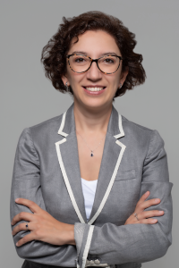
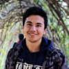
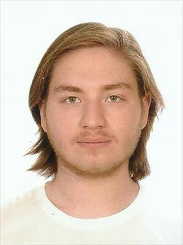

# Team

<b>Head of The Lab:</b> Assoc. Prof. Didem Unat

<b>Project Adminsitrative Assistant:</b> Sinemis Temel

<b>Previous Member:</b> Ismayil Ismayilov
<cr>
Research Focus: Taming heterogeneity, programming models

<b>Previous Member:</b> Muhammad Abdullah Soyturk

<b>PostDoc:</b> Dr. Muhammad Aditya Sasongko
<cr>
Research Focus: Performance Models, Profiling Tools

<b>PhD Student:</b> Ilyas Turimbetov

<cr>
Research Focus: Quantum Computing, Digital Annealers, Quantum Algorithms.

<b>PhD Student:</b> Mohammad Kefah Taha Issa
<cr>
Research Focus: Peer to peer GPU tracing and profiling.

<b>PhD Student:</b> Javid Baydamirli
<cr>
Research Focus: Taming heterogeneity, programming models

<b>PhD Student:</b> Doǧan Sağbili
<cr>
Research Focus: Novel Programming models for emerging architectures.

