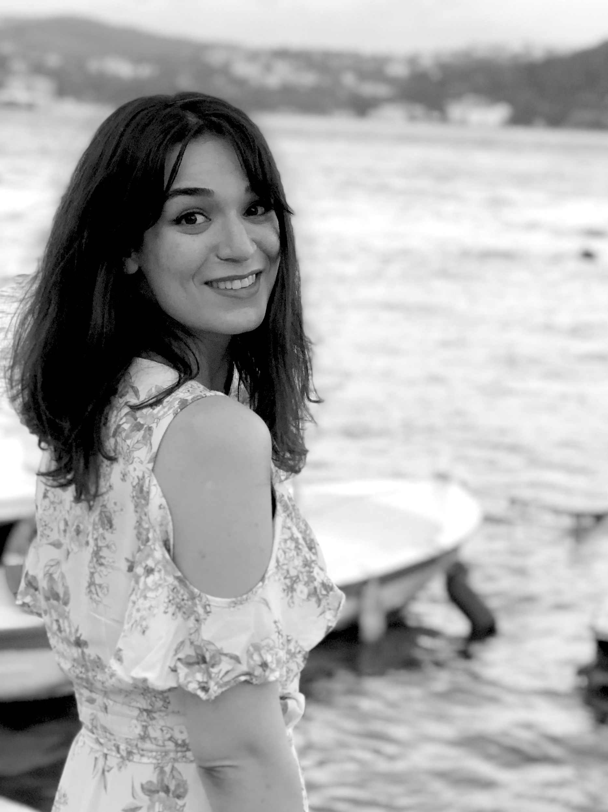
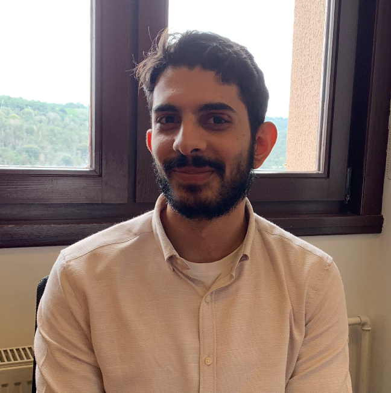

# Team

  

    
    

    <b>Head of The Lab:</b> Assoc. Prof. Didem Unat
    

  

  

    
    

    <b>Project Adminsitrative Assistant:</b> Sinemis Temel
    

  

  

    
    

    <b>Previous Member:</b> Ismayil Ismayilov
     
    <b>Research Focus:</b> Taming heterogeneity, programming models
    

  

  

    
    

    <b>Previous Member:</b> Muhammad Abdullah Soyturk
    

  

  

    
    

    <b>PostDoc:</b> Dr. Muhammad Aditya Sasongko
     
    <b>Research Focus:</b> Performance Models, Profiling Tools
    

  

  

    
    

    <b>PhD Student:</b> Ilyas Turimbetov
     
    <b>Research Focus:</b> Quantum Computing, Digital Annealers, Quantum Algorithms.
    

  

  

    
    

    <b>PhD Student:</b> Mohammad Kefah Taha Issa
     
    <b>Research Focus:</b> Peer to peer GPU tracing and profiling.
    

  

  

    
    

    <b>PhD Student:</b> Javid Baydamirli
     
    <b>Research Focus:</b> Taming heterogeneity, programming models
    

  

  

    
    

    <b>PhD Student:</b> Doǧan Sağbili
     
    <b>Research Focus:</b> Novel Programming models for emerging architectures.
    

  

